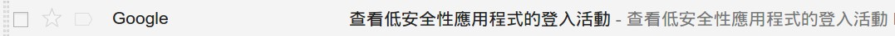
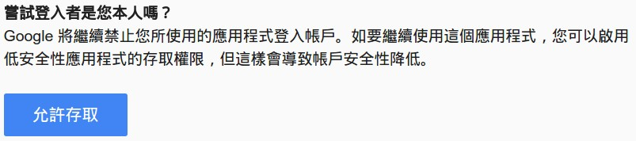
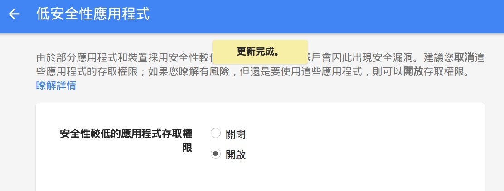
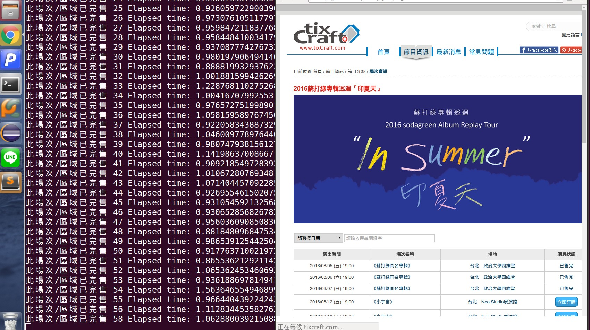
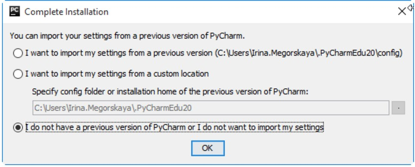
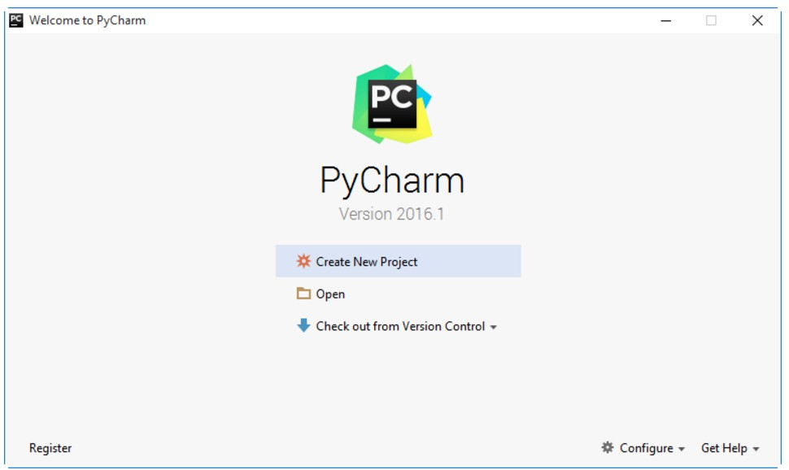
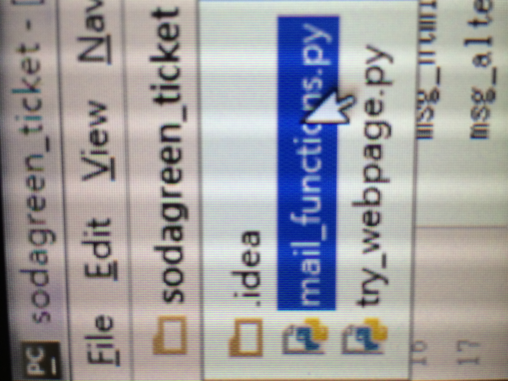
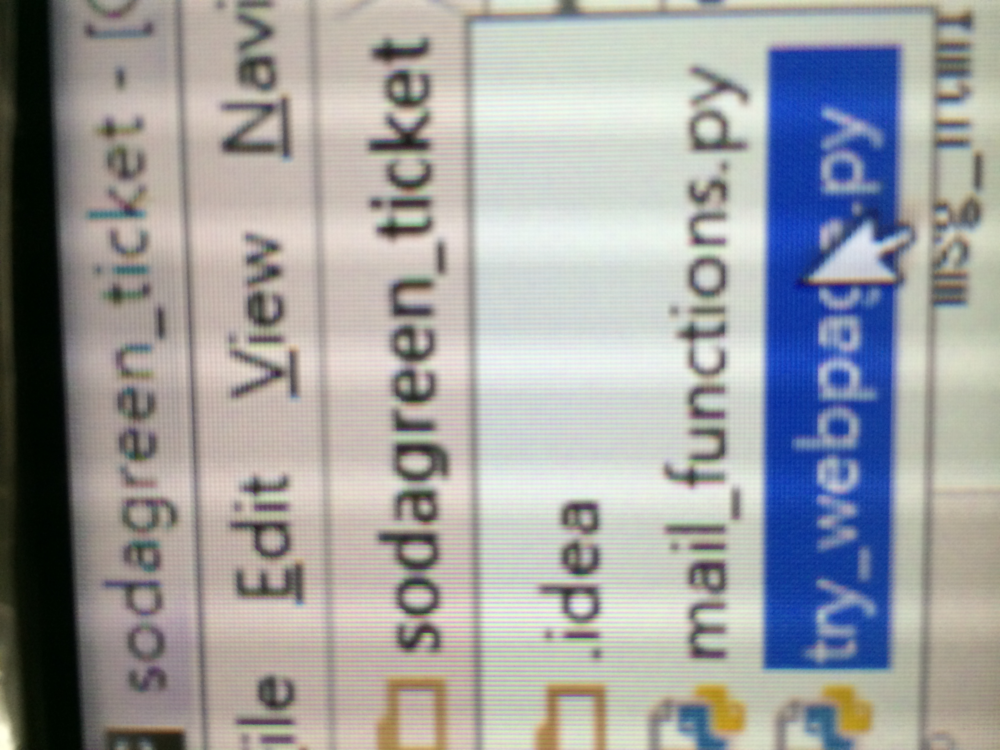
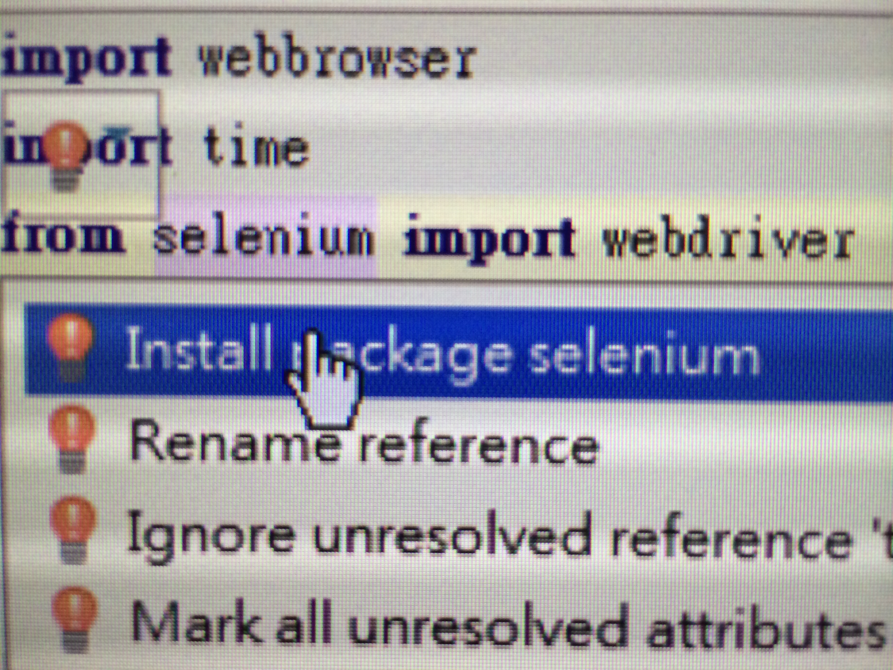

## Script to check ticketing system for remaining tickets

### Ubuntu 使用者操作步驟
1. 點選本頁面右側的 Clone or download，選擇 Download ZIP，並於解壓縮後將 **mail_functions.py** 及 **try_webpage.py** 檔案放於家目錄底下。
2. 打開terminal (終端機)，並依序輸入 （以下步驟若有要求輸入密碼，請輸入電腦密碼） 
`sudo apt-get install python-pip python-dev build-essential` 
`sudo pip install --upgrade pip ` 
`sudo pip install --upgrade virtualenv ` 
`sudo pip install selenium` 

3. 依據電腦為32或64位元，於此[載點](http://chromedriver.storage.googleapis.com/index.html?path=2.23%2F)下載 chrome driver 壓縮檔。 

4. 壓縮檔解壓縮後，將 **chromedriver** 檔案放於適合的位置（例如家目錄底下）。
5. 打開 **mail_functions.py** 檔案，並將 30、31行的 gmail_user, gmail_pwd 修改為自己的 gmail 帳號密碼。
6. 於 terminal (終端機) 輸入
`python mail_functions.py ` 
7. 假如出現 Error，即代表尚未允許 低安全性應用程式的存取權限，應該會收到來自 Google 的信件，如下圖

8. 打開信件後，於下圖 允許存取 的按鈕處點選 
 

  再點選開啟，即更新完成 
   
9. 請稍等片刻後再次嘗試第六步，就會成功收到自己寄給自己的測試郵件了！ 
10. 打開 **try_webpage.py** 檔案，61行處即顯示您想要搶的場次，可於此處進行更改 （刪除無法前往之場次） 
例如：只想要搶 <<小宇宙>> 及 <<陪我歌唱>> 場次，即可修改此行為 
`codes = univ + sing` 
11. 修改 67 行為 **chromedriver** 的放置位置（檔案路徑）。 
12. 於 terminal (終端機) 輸入
`python try_webpage.py ` 
13. 若是一切正常，應該就會出現以下畫面，並在有票的時候，您就會寄信件給自己了。 

14. 此外，若是您無時無刻都在電腦旁邊，希望在有票時，瀏覽器自動打開有票的選票畫面， 可將 **try_webpage.py** 71行 修改為
`should_notify_user = True` 
注意！做此更改會於有票時直接終止程式以防止繼續在瀏覽器開啟新視窗。   
 若要繼續搶票，請再次於 terminal (終端機) 輸入
`python try_webpage.py `  
15. 最後，若是希望有票時同時播放音樂做提醒，請將11、12行前的#字號刪除，變成 
`webbrowser.open("https://www.youtube.com/watch?v=c9e-80s3kOY&t=1m")`  
`time.sleep(2.2)`    

16. 中止程式請於 terminal連續輸兩 ctrl + c 即可！

### Mac 使用者操作步驟
1. 點選本頁面右側的 Clone or download，選擇 Download ZIP，並於解壓縮後將 **mail_functions.py** 及 **try_webpage.py** 檔案放於家目錄底下。
2. 打開terminal (終端機)，並依序輸入 （以下步驟若有要求輸入密碼，請輸入電腦密碼） 
`sudo easy_install pip` 
`sudo pip install selenium` 
3. 於此[載點](http://chromedriver.storage.googleapis.com/index.html?path=2.23%2F)下載 chromedriver_mac32 壓縮檔。 
4. 以下步驟與上面 Ubuntu 4 - 15 步相同  

### Windows 使用者操作步驟
1. 點選本頁面右側的 Clone or download，選擇 Download ZIP，並於解壓縮後將資料夾存於任意位置。
2. 於此[載點](http://chromedriver.storage.googleapis.com/index.html?path=2.23%2F)下載 chromedriver_win32 壓縮檔。 
3. 壓縮檔解壓縮後，將 **chromedriver.exe** 檔案放於 C 槽底下。
4. 於此[載點](https://www.jetbrains.com/pycharm/download/#section=windows) 點選Community 的 Download 按鈕下載並安裝 PyCharm 編譯器。  當被詢問以下資訊時，請選擇第三個選項。
 
5. 開啟 PyCharm 編譯器，並在以下畫面選擇 Open  
 
請選擇第一步所下載並解壓縮完畢的資料夾 （應該包含 **mail_functions.py** 及 **try_webpage.py**），並點選確認。  
6. 於左上角點選資料夾名稱，並選擇 **mail_functions.py** 檔案
 
7. 出現程式碼後，請將 30、31行的 gmail_user, gmail_pwd 修改為自己的 gmail 帳號密碼。 
8. 同時按住 ctrl+shift+F10 執行檔案。  
9. 假如出現 Error，即代表尚未允許 低安全性應用程式的存取權限，應該會收到來自 Google 的信件，如下圖

10. 打開信件後，於下圖 允許存取 的按鈕處點選 
 

  再點選開啟，即更新完成 
   
11. 請稍等片刻後再次嘗試第八步，就會成功收到自己寄給自己的測試郵件了！ 

12. 接著於左上角點選資料夾名稱，並選擇 **try_webpage.py** 檔案
 
13. 此時應該會看到 3 - 6 行的 selenium 字底下出現紅線，此時請將滑鼠游標移至紅線處，就會出現紅色燈泡，此時點選選單之 Install package selenium 即可。此時，紅線應該消失。
 

14. 61行處即顯示您想要搶的場次，可於此處進行更改 （刪除無法前往之場次） 
例如：只想要搶 <<小宇宙>> 及 <<陪我歌唱>> 場次，即可修改此行為 
`codes = univ + sing` 
15. 修改 67 行為 **chromedriver.exe** 的放置位置（檔案路徑）。 
例如：將**chromedriver.exe** 直接存於 C 槽下的話，即可修改此行為 
`driver_position = ”C:/chromedriver.exe”` 
16. 同時按住 ctrl+shift+F10 執行檔案。  
17. 若是一切正常，應該就會出現以下畫面，並在有票的時候，您就會寄信件給自己了。 

18. 此外，若是您無時無刻都在電腦旁邊，希望在有票時，瀏覽器自動打開有票的選票畫面， 可將 **try_webpage.py** 71行 修改為
`should_notify_user = True` 
注意！做此更改會於有票時直接終止程式以防止繼續在瀏覽器開啟新視窗。   
 若要繼續搶票，請再次 ctrl+shift+F10 執行檔案。
19. 最後，若是希望有票時同時播放音樂做提醒，請將11、12行前的#字號刪除，變成 
`webbrowser.open("https://www.youtube.com/watch?v=c9e-80s3kOY&t=1m")`  
`time.sleep(2.2)`   
20. 中止程式請於下圖左方紅色框框處連續點選兩次即可！
